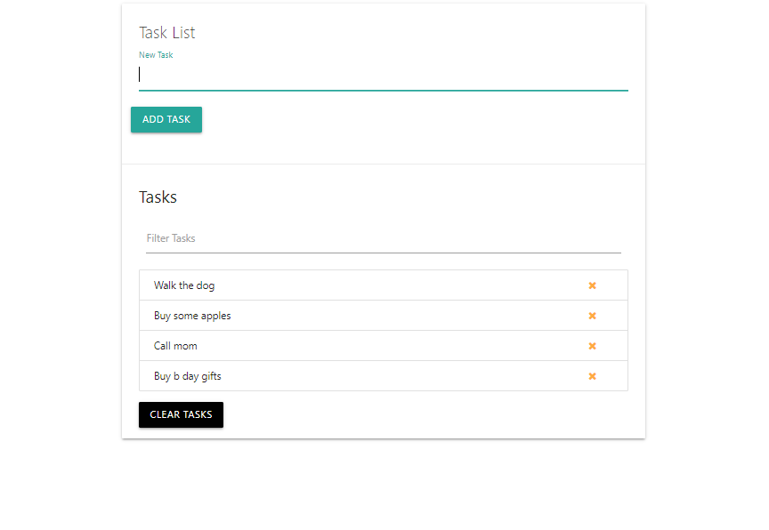
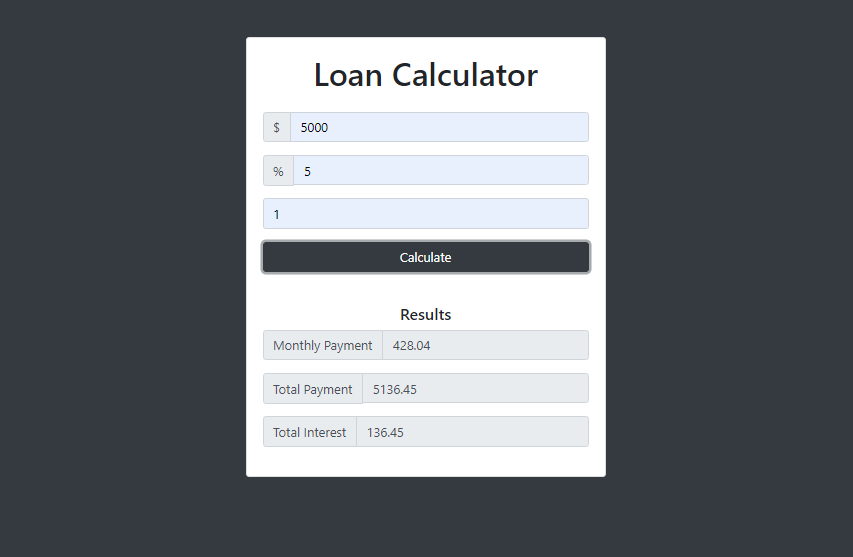
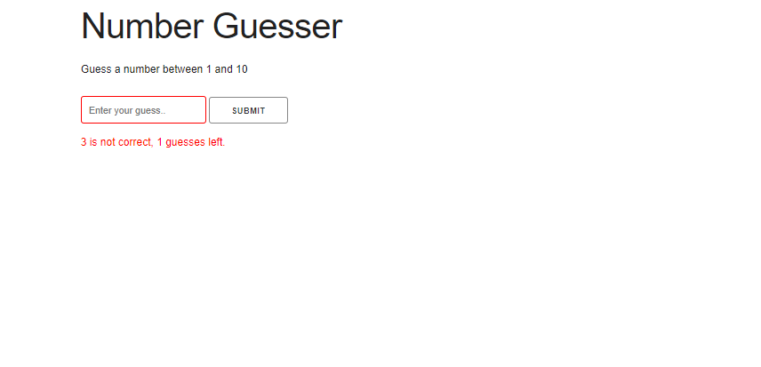
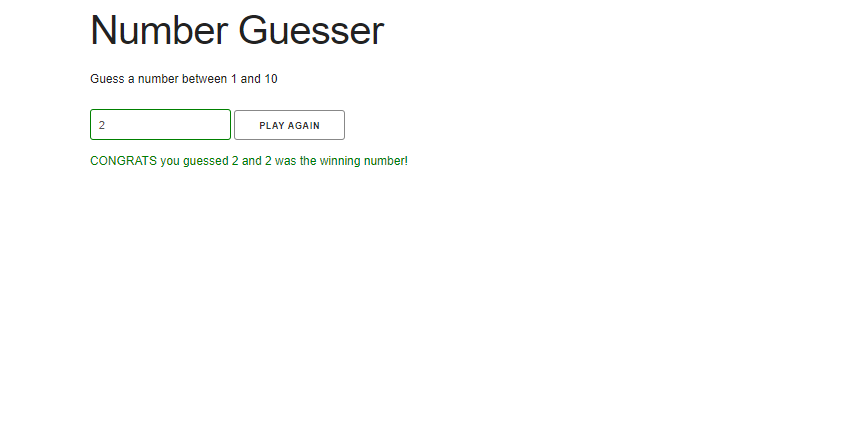
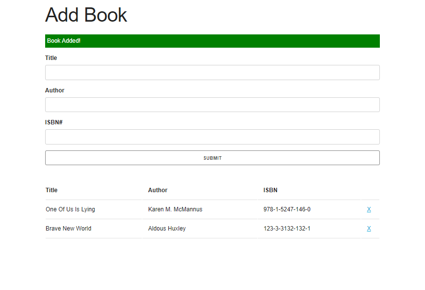
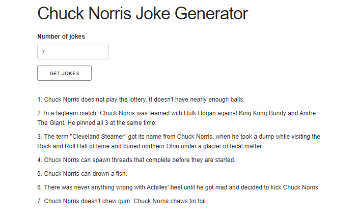
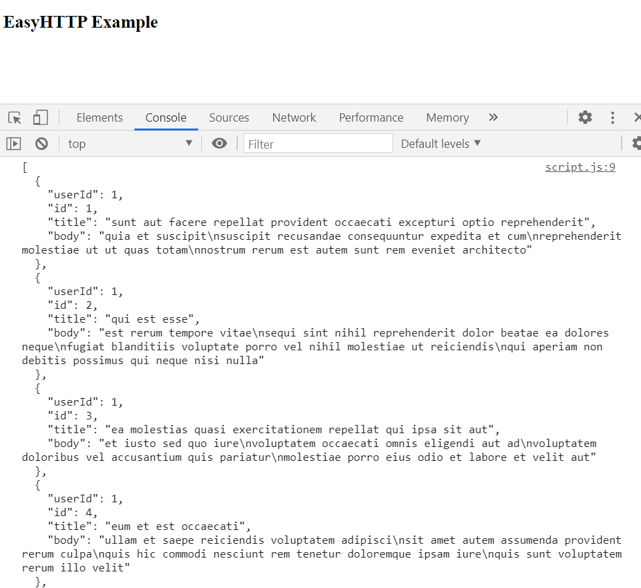

# Modern JS with Brad Traversy

---

This is a repo containing all the coding projects I created while following the 'Modern Javascript From The Beginning' udemy couse lead by Brad Traversy. They all contain HTML, CSS and Vanilla Javscript.

## DOM Projects

These projects are all practicing Javascript DOM events some include:

- querySelector
- querySelectorAll
- addEventListener
- getElementById
- insertBefore
- appendChild
- parentElement

---

### 1 .) Task List

### 2 .) Loan Calculator

### 3 .) Number Guesser

Wrong Answer Feedback

Right Answer Feedback

## OOP Project

This project uses HTML, CSS, and JS. This project is centered around object oriented programming. We use ES5 prototypes and ES6 classes to build the same app to demonstrate the differences and get familar with each.

### ES5 topics covered

- the 'this' keyword
- prototypes
- prototype constructors

### ES5 topics covered

- classes
- subclasses

---

### 1. ) Book List

## Async JS, Ajax & Fetch API Projects

These projects were built using a mix of:

- Async & Await
- ES6 promises
- Ajax
- XHR
- JSON
- Fetch API
- HTTP Requests

---

### 1. ) Chuck Norris Joke Generator

This project is built with Ajax the simple app will fetch a set of chuck norris jokes based on the amount a user gives, return them and display them in the browser using DOM manipulation.

### 2. ) Easy HTTP

This project is custom ES5 object oriented HTTP AJax XHR library with callbacks using prototypes (will be updated using the Fetch API & ES6 classes).

